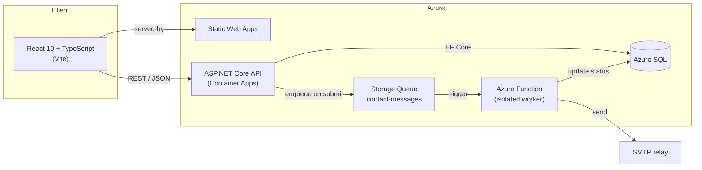
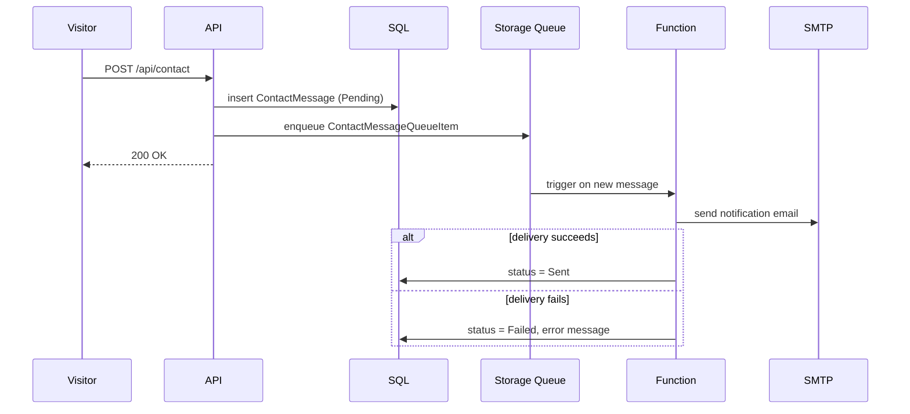
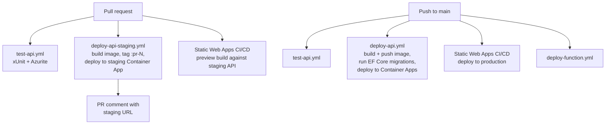

# vinty.dev

Source for my personal site and CV: [vinty.dev](https://vinty.dev). A React frontend backed by an ASP.NET Core API, with contact form delivery handled asynchronously through a queue-triggered Azure Function rather than inline in the request path.

This document covers the architecture and the reasoning behind the choices made. 

## Architecture



The frontend and API are deployed independently and don't share a runtime. The API never sends email itself: it writes the message to SQL and drops a lightweight item on a queue, so a submission that races or a slow SMTP handshake can't make a visitor wait on a request. The Function that actually sends the mail scales independently, retries independently, and can fail without taking the API down with it.

## Contact form flow

The part of this project I'd point to first is the decoupling between "the API acknowledges a message" and "the email actually goes out."



The Function talks to SQL with a plain `SqlConnection`, not EF Core, it's a separate deployable with its own project file, and pulling in the whole DbContext for a single status update column isn't worth the coupling. If SMTP is down, the message is already durably stored with a `Pending` status; nothing is lost, and the failure reason is recorded against the row instead of just a stack trace in a log.

## Stack

**Frontend** — `client/`
- React 19, TypeScript, Vite
- React Router for client-side routing (Home, Projects, CV)
- CSS Modules, no component library > layout, panning/zoom on the CV viewer, and section-scroll tracking are hand-rolled hooks (`usePanZoom`, `useZoom`, `useActiveSection`)
- `react-pdf` for in-browser CV rendering
- Thin `fetch` wrapper (`src/api`) rather than a data-fetching library, paired with small hooks per resource (`useProjects`, `useExperience`, `useSiteStatus`)

**API** — `server/`
- ASP.NET Core Web API on .NET 10
- EF Core against SQL Server, with `AsNoTracking()` on every read-only query path
- CORS locked to a configured client origin, plus a suffix match for per-PR static web app preview URLs
- Health check endpoint (`/healthz`) used by the container platform
- Migrations are generated locally and applied explicitly in CI, not on application startup, so cold starts don't have to wait for an entire schema initialisation process. 

**Async processing** — `server/VintyDev.ContactFunction/`
- Isolated-worker Azure Function, queue-triggered
- MailKit/MimeKit for SMTP delivery
- Independent `.csproj`, explicitly excluded from the API's build so the two stay decoupled

**Data**
- SQL Server locally via Docker (`scripts/dev.sh` boots the container and waits for it to accept connections before starting the app)
- Azure SQL in production

**Infrastructure**
- Frontend: Azure Static Web Apps
- API: Docker image built in CI, pushed to GHCR, deployed to Azure Container Apps
- Function: deployed separately, triggered only by changes under its own folder
- Every path-scoped workflow (`deploy-api.yml`, `deploy-function.yml`, `test-api.yml`) filters on the folders it actually cares about, so a frontend-only change doesn't trigger an API deploy and vice versa

## CI/CD



Every pull request that touches the API gets its own live staging deployment, a real Container App running the PR's image, commented back onto the PR, and the frontend preview build points at that staging API rather than production. So a full-stack change can be reviewed end to end on a real URL before it merges, without touching the production database. Migrations only ever run on the `main` branch workflow, against the same connection string the running container uses, which keeps staging and production sharing one schema without staging ever being allowed to move it.

API tests run against Azurite (the Azure Storage emulator) so the queue-sending path is tested against something that behaves like the real service.

## Running locally

Requires Docker Desktop, Node, and the .NET 10 SDK.

```bash
npm run dev
```

This starts (or creates if it does not yet exist) the local SQL Server container, waits for it to accept connections, then runs the Vite dev server and the API concurrently via `dotnet watch`.

## Project layout

```
client/     React + TypeScript frontend
server/     ASP.NET Core API
  Controllers/    HTTP endpoints
  Models/         EF Core entities
  Dto/            API response shapes
  Services/       queue sender abstraction
  Data/           DbContext, seeding
  VintyDev.ContactFunction/   Azure Function, deployed separately
  VintyDev.Api.Tests/         xUnit tests
scripts/    local dev bootstrap
```
